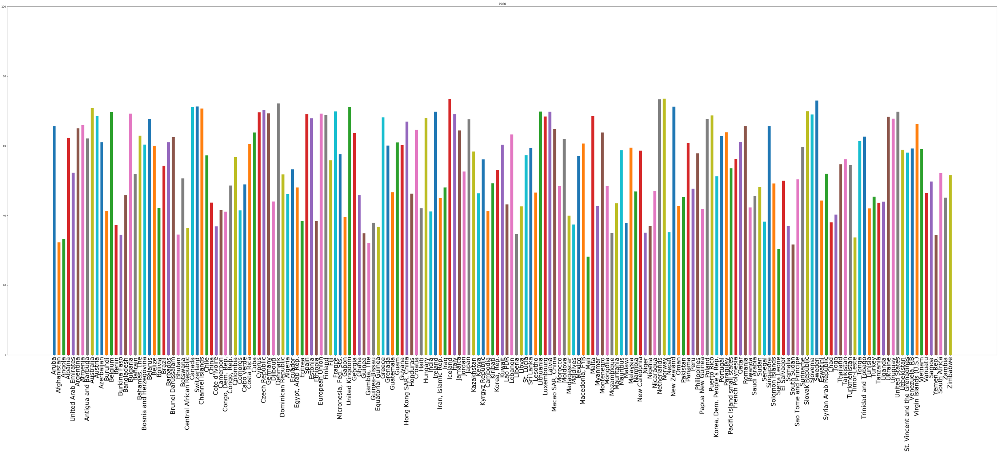

# Life-Expectancy-1960-2016
This is a simple python script to describe the average life expectancy around the globe per country from 1960 to 2016. Attached is the gif created using this information.

